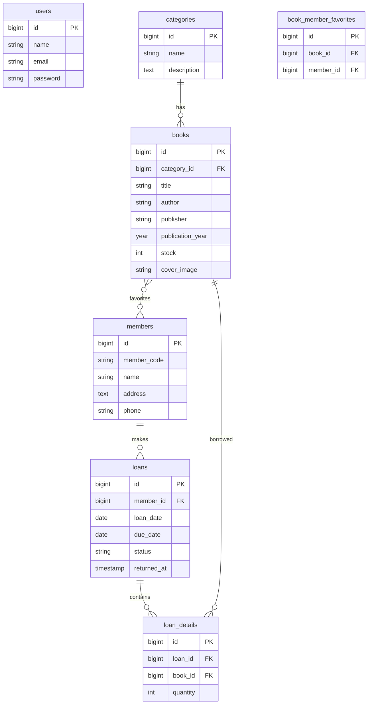

# Sistem Informasi Perpustakaan Berbasis Web

Dokumen ini menjelaskan implementasi Laravel 12, Filament v5, Tailwind CSS, MySQL, dan Spatie Laravel Permission pada proyek ini.

## 1. Analisis Kebutuhan Sistem

Aktor:
- Admin: mengelola semua data, user, role, dan permission.
- Petugas: mengelola buku, anggota, dan transaksi peminjaman/pengembalian.

Fitur:
- Login dan logout melalui Filament Auth di `/admin`.
- CRUD kategori, buku, anggota, peminjaman, dan user.
- Upload cover buku ke `storage/app/public/books`.
- Relasi favorit many-to-many antara anggota dan buku.
- Pengurangan stok saat peminjaman dibuat.
- Penambahan stok saat status peminjaman menjadi `Dikembalikan`.
- Dashboard statistik perpustakaan.

## 2. ERD



## 3. Struktur Database

Tabel utama:
- `users`: akun login panel.
- `categories`: master kategori buku.
- `books`: master buku dan stok.
- `members`: anggota perpustakaan.
- `loans`: header transaksi peminjaman.
- `loan_details`: detail buku yang dipinjam.
- `book_member_favorites`: pivot favorit anggota.
- `roles`, `permissions`, `model_has_roles`, `model_has_permissions`, `role_has_permissions`: RBAC Spatie.

Soft delete diterapkan pada `categories`, `books`, `members`, dan `loans`.

## 4. Migration

File:
- `database/migrations/2026_06_10_000001_create_permission_tables.php`
- `database/migrations/2026_06_10_000002_create_library_tables.php`

Relasi penting:
- `books.category_id -> categories.id`
- `loans.member_id -> members.id`
- `loan_details.loan_id -> loans.id`
- `loan_details.book_id -> books.id`
- `book_member_favorites.book_id -> books.id`
- `book_member_favorites.member_id -> members.id`

## 5. Model dan Relationship

File model:
- `app/Models/Category.php`: `books()`
- `app/Models/Book.php`: `category()`, `loanDetails()`, `favoritedByMembers()`
- `app/Models/Member.php`: `loans()`, `favoriteBooks()`
- `app/Models/Loan.php`: `member()`, `details()`
- `app/Models/LoanDetail.php`: `loan()`, `book()`
- `app/Models/User.php`: memakai `HasRoles` dan `canAccessPanel()`

## 6. Seeder dan Isi Contoh Tiap Tabel

Seeder:
- `database/seeders/RolePermissionSeeder.php`
- `database/seeders/DatabaseSeeder.php`

Contoh isi `users`:

| name | email | password | role |
|---|---|---|---|
| Administrator | admin@library.test | password | Admin |
| Petugas Perpustakaan | petugas@library.test | password | Petugas |

Contoh isi `categories`:

| name | description |
|---|---|
| Teknologi | Buku pemrograman, sistem informasi, dan teknologi digital. |
| Novel | Koleksi karya fiksi dan sastra populer. |
| Sains | Buku ilmu pengetahuan umum dan penelitian ilmiah. |

Contoh isi `books`:

| category | title | author | publisher | year | stock |
|---|---|---|---|---|---|
| Teknologi | Laravel Enterprise Patterns | Raka Pratama | Nusantara Tech Press | 2025 | 8 |
| Teknologi | Dasar Sistem Informasi | Dewi Kartika | Akademika | 2022 | 12 |
| Novel | Jejak Kota Lama | Mira Lestari | Pustaka Cerah | 2020 | 6 |
| Sains | Eksperimen Sains Harian | Bima Santoso | Cendekia Media | 2021 | 10 |

Contoh isi `members`:

| member_code | name | address | phone |
|---|---|---|---|
| MBR-0001 | Andi Saputra | Jl. Merdeka No. 10 | 081234567890 |
| MBR-0002 | Siti Aminah | Jl. Melati No. 7 | 082233445566 |
| MBR-0003 | Rizky Maulana | Jl. Kenanga No. 3 | 083344556677 |

Contoh isi `loans`:

| member | loan_date | due_date | status |
|---|---|---|---|
| Andi Saputra | H-3 dari seed | H+4 dari seed | Dipinjam |
| Siti Aminah | H-10 dari seed | H-3 dari seed | Dikembalikan |

Contoh isi `loan_details`:

| loan | book | quantity |
|---|---|---|
| Andi Saputra | Laravel Enterprise Patterns | 1 |
| Siti Aminah | Jejak Kota Lama | 2 |

Contoh isi `book_member_favorites`:

| member | favorite books |
|---|---|
| Andi Saputra | Laravel Enterprise Patterns, Jejak Kota Lama |
| Siti Aminah | Dasar Sistem Informasi |

## 7. Spatie Permission Setup

Dependency ditambahkan di `composer.json`:

```json
"spatie/laravel-permission": "^6.0"
```

Konfigurasi:
- `config/permission.php`
- Middleware alias di `bootstrap/app.php`: `role`, `permission`, `role_or_permission`
- `User` memakai trait `Spatie\Permission\Traits\HasRoles`

Role:
- `Admin`: semua permission.
- `Petugas`: buku, kategori view, anggota, dan peminjaman. Tidak punya permission user.

## 8. Observer dan Service

File:
- `app/Services/LoanInventoryService.php`
- `app/Observers/LoanObserver.php`
- `app/Http/Requests/StoreLoanRequest.php`
- `app/Http/Requests/UpdateLoanStatusRequest.php`

Alur:
- Create loan dari Filament memanggil `reserveStockForLoan()` setelah detail tersimpan.
- Update status menjadi `Dikembalikan` memanggil `restoreStockForReturnedLoan()` melalui observer.
- Validasi stok memakai `ValidationException` agar Filament menampilkan error yang jelas.

## 9. Filament Resources

Resource:
- `app/Filament/Resources/Books/BookResource.php`
- `app/Filament/Resources/Categories/CategoryResource.php`
- `app/Filament/Resources/Members/MemberResource.php`
- `app/Filament/Resources/Loans/LoanResource.php`
- `app/Filament/Resources/Users/UserResource.php`

Setiap resource berisi form dengan validation, placeholder, helper text, required field, dan select relationship. Table berisi searchable, sortable, filters, record action, bulk action, dan trashed filter untuk model soft delete.

Relation manager:
- Category -> Books
- Book -> FavoritedByMembers
- Member -> Loans
- Member -> FavoriteBooks
- Loan -> Details

## 10. Dashboard Widget

File:
- `app/Filament/Widgets/LibraryStatsOverview.php`

Statistik:
- Total Buku
- Total Anggota
- Total Peminjaman
- Total Pengembalian
- Buku Tersedia

## 11. Routing

Routing utama:
- `/` redirect ke `/admin`
- `/admin` panel Filament

File:
- `routes/web.php`
- `app/Providers/Filament/AdminPanelProvider.php`

## 12. Folder Structure

```text
app/
  Enums/LoanStatus.php
  Filament/Resources/
  Filament/Widgets/LibraryStatsOverview.php
  Models/
  Observers/LoanObserver.php
  Policies/
  Services/LoanInventoryService.php
config/permission.php
database/
  factories/
  migrations/
  seeders/
docs/IMPLEMENTASI_SISTEM_PERPUSTAKAAN.md
```

## 13. Source Code Lengkap

Source code sudah berada langsung di folder proyek. File paling penting:
- Migration database: `database/migrations`
- Model dan relationship: `app/Models`
- Business logic: `app/Services/LoanInventoryService.php`
- Observer: `app/Observers/LoanObserver.php`
- Policy: `app/Policies`
- Filament resource: `app/Filament/Resources`
- Dashboard widget: `app/Filament/Widgets/LibraryStatsOverview.php`
- Seeder: `database/seeders`

## 14. Langkah Instalasi

1. Pastikan database MySQL sudah dibuat.
2. Atur `.env`:

```env
DB_CONNECTION=mysql
DB_HOST=127.0.0.1
DB_PORT=3306
DB_DATABASE=perpustakaan
DB_USERNAME=root
DB_PASSWORD=
FILESYSTEM_DISK=public
```

3. Install dependency:

```bash
composer install
composer require spatie/laravel-permission
npm install
```

4. Generate key dan storage link:

```bash
php artisan key:generate
php artisan storage:link
```

5. Migrasi dan seed:

```bash
php artisan migrate:fresh --seed
```

6. Jalankan aplikasi:

```bash
php artisan serve
npm run dev
```

Login:
- Admin: `admin@library.test` / `password`
- Petugas: `petugas@library.test` / `password`

## 15. Testing dan Debugging

Pemeriksaan yang sudah dilakukan:
- `php -l` untuk semua file PHP aplikasi, config, migration, factory, dan seeder: lulus sintaks.

Perintah lanjutan setelah Spatie terpasang:

```bash
php artisan test
php artisan migrate:fresh --seed
php artisan route:list
php artisan optimize:clear
```

Checklist manual:
- Login Admin berhasil dan dapat membuka menu User.
- Login Petugas berhasil dan menu User tidak dapat dikelola.
- Upload cover JPG/PNG maksimal 2 MB tampil di tabel buku.
- Membuat peminjaman mengurangi stok.
- Mengubah status ke `Dikembalikan` menambah stok.
- Relation manager favorit bisa attach/detach buku dan anggota.
